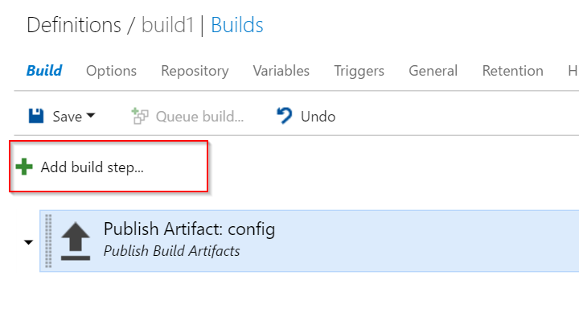
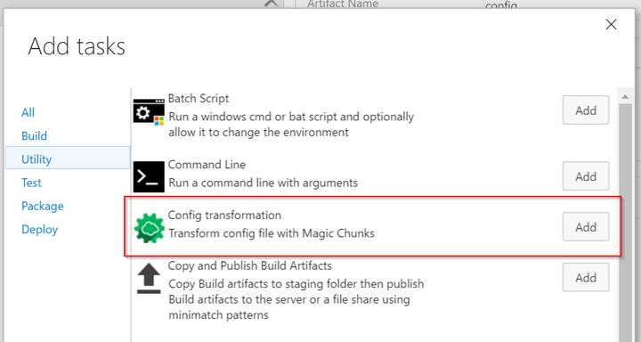
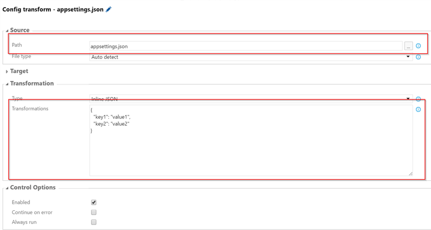
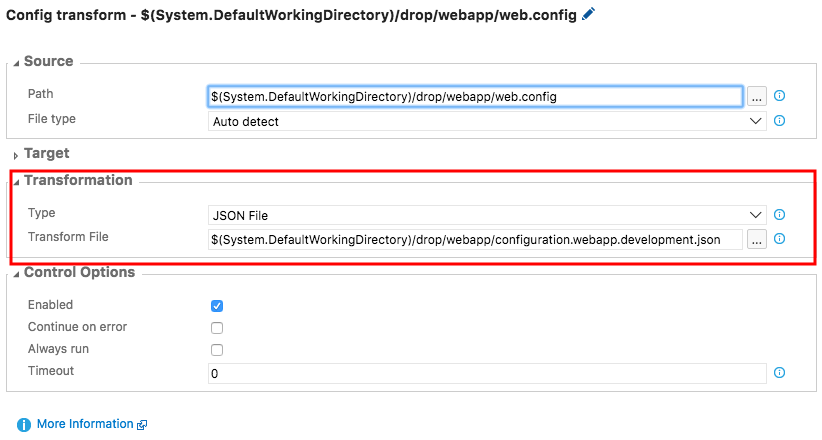
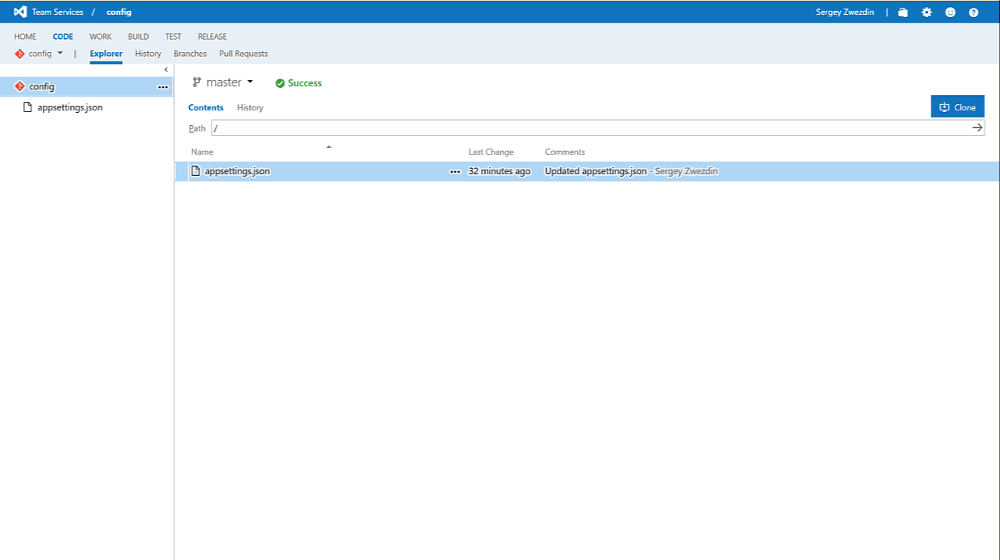

**Magic Chunks** is easy to use tool to config transformations for JSON, XML and YAML.

Everyone remember [XML Document Transform](https://msdn.microsoft.com/en-us/library/dd465326.aspx) syntax to transform configuration files during the build process. But world is changing and now you can have different config types in your .NET projects.

Magic Chunks allows you to transform you **JSON**, **XML** and **YAML** files. You can run it at MSBuild, Cake, PSake or Powershell script as well as use this Visual Studio Team Services build extension.


# How it works

The main idea is quite simple. Magic Chunks represents transformation as a *key-value* collection.

The key contains path at source file which should be modified. And the value contains data for this path in modified file.

Imagine you have following **JSON based configuration** file.


```json
{
  "ConnectionStrings": {
    "DefaultConnection": "Server=(localdb)\\mssqllocaldb;Database=webapp"
  }
}
```

So following **transformations** could be applied to this config:


```json
{
  "ConnectionStrings/DefaultConnection": "Data Source=10.0.0.5;Initial Catalog=Db1"
}
```

As a **result** you will have:

```json
{
  "ConnectionStrings": {
    "DefaultConnection": "Data Source=10.0.0.5;Initial Catalog=Db1"
  }
}
```

# Getting started

### Step 1: Install this extension into your VSTS account.
### Step 2: In your build or release definition add new build step.

### Step 3: Select "Config transformation" under "Utility" group and click "Add".

### Step 4: Specify configuration file path and required transformations.

### Alternately, specify a path to a file containing the transformations.

### Step 5: Run build. Profit!

# Setup in 30 seconds

